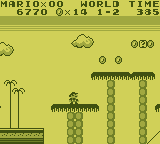
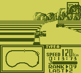
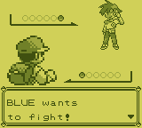
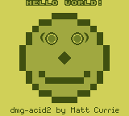

# GameboyTKP
Gameboy emulator written in C++ for [TKPEmu](https://github.com/OFFTKP/TKPEmu).

This emulator can be integrated into other projects. Check `example_main.cpp` for an example.

## Features with TKPEmu
 - Customizable palette
 - Customizable controls
 - Disassembler/Debugger
 - Advanced breakpoints
 - Tracelogger
 - Save states 
 - Rewind functionality (WIP)

## Images

## Resources
This emulator would not be possible without the use of these resources, as acquiring a DMG Gameboy     
becomes harder and harder by the day.

**[PanDocs](https://gbdev.io/pandocs/):**    
Very detailed document explaining tons of gameboy behavior. The best document to get started.

**[TCAGBD by AntonioND](https://github.com/AntonioND/giibiiadvance/blob/master/docs/TCAGBD.pdf):**    
Great and very detailed timer explanation.    

**[Blargg tests](https://github.com/retrio/gb-test-roms):**    
Very good testing suites. cpu_instrs is a great start for emulator development.    

**[Mooneye tests](https://github.com/Gekkio/mooneye-test-suite/):**    
Also very good testing suites. Tests some advanced mid-instruction timing, and has      
advanced timer/ppu behavior tests. Also very useful mbc tests.    

**[mattcurie's dmg_acid2 test](https://github.com/mattcurrie/dmg-acid2):**    
Best test to get started on correct ppu output

## Tests

See generated test results [here](./TEST_RESULTS.md).    
Always generate new test results before pushing a commit when changing the code.

**[mattcurie](https://github.com/mattcurrie)'s tests:**
|Test|GameboyTKP  |
|--|--|
| dmg-acid2 |  |

## License
TKPEmu is licensed under the MIT license    
Copyright (C) 2021-2021 Paris Oplopoios
