| Expected result | Actual result |
| --- | --- |
|  | 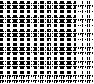 |
|  | 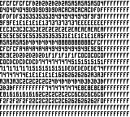 |
|  | 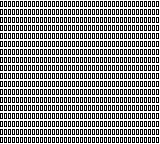 |
|  | 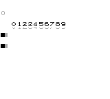 |
|  | 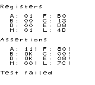 |
|  |  |
|  | 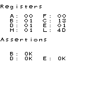 |
|  | 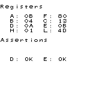 |
|  | 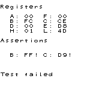 |
|  |  |
|  |  |
|  |  |
|  |  |
|  |  |
|  |  |
|  | 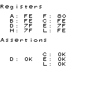 |
|  | 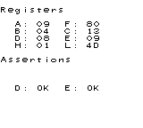 |
|  | 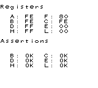 |
|  |  |
|  |  |
|  |  |
|  |  |
|  |  |
|  |  |
|  | 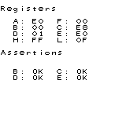 |
|  | 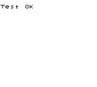 |
|  | 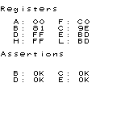 |
|  |  |
|  | 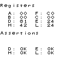 |
|  | 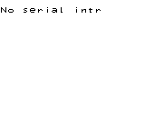 |
|  | 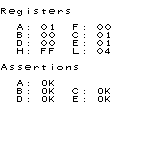 |
|  | 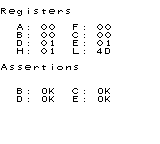 |
|  | 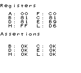 |
|  |  |
|  | 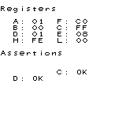 |
|  |  |
|  |  |
|  |  |
|  | 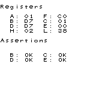 |
|  |  |
|  |  |
|  | 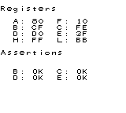 |
|  | 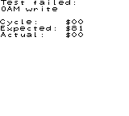 |
|  | 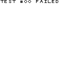 |
|  | 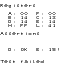 |
|  | 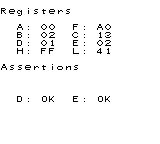 |
|  | 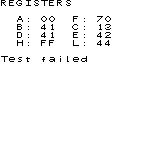 |
|  | 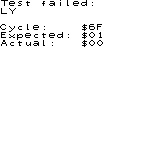 |
|  | 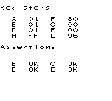 |
|  | 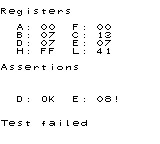 |
|  |  |
|  | 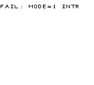 |
|  | 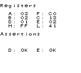 |
|  | 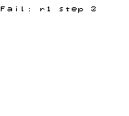 |
|  | 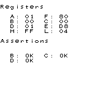 |
|  |  |
|  |  |
|  | 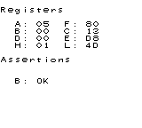 |
|  |  |
|  | 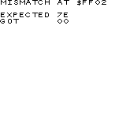 |
|  | 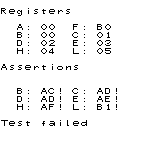 |
|  |  |
|  | 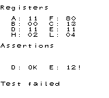 |
|  | 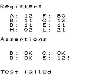 |
|  |  |
|  | 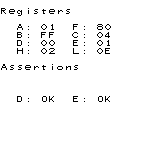 |
|  | 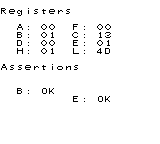 |
|  | 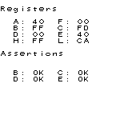 |
|  |  |
|  |  |
|  | 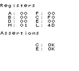 |
|  | 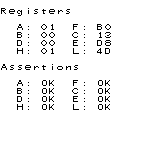 |
|  |  |
|  |  |
|  |  |
|  |  |
|  | 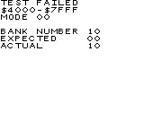 |
|  |  |
|  |  |
|  |  |
|  |  |
|  | 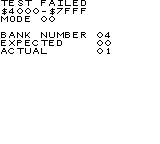 |
|  |  |
|  |  |
|  |  |
|  |  |
|  |  |
|  |  |
|  |  |
|  |  |
|  |  |
|  |  |
|  |  |
|  |  |
|  |  |
|  |  |
|  |  |
|  |  |
|  |  |
|  |  |
|  |  |
|  | 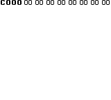 |
|  | 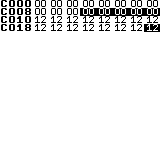 |
|  |  |
|  | 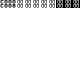 |
|  | 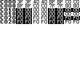 |
|  |  |
|  |  |
|  |  |
|  |  |
|  |  |
|  |  |
|  |  |
|  |  |
|  |  |
|  |  |
|  |  |
|  |  |
|  |  |
|  |  |
|  |  |
|  |  |
|  |  |
|  |  |
|  |  |
|  |  |
|  |  |
|  |  |
|  |  |
|  |  |
|  |  |
|  |  |
|  |  |
|  |  |
|  |  |
|  |  |
|  |  |
|  |  |
|  |  |
|  |  |
|  |  |
|  |  |
|  |  |
|  |  |
|  |  |
|  |  |
|  |  |
|  |  |
|  |  |
|  |  |
|  |  |
|  |  |
|  |  |
|  |  |
|  |  |
|  |  |
|  |  |
|  |  |
|  |  |
|  |  |
|  |  |
|  |  |
|  |  |
|  |  |
|  |  |
|  |  |
|  |  |
|  |  |
|  |  |
|  |  |
|  |  |
|  |  |
|  |  |
|  |  |
|  |  |
|  |  |
|  |  |
|  |  |
|  |  |
|  |  |
|  |  |
|  |  |
|  |  |
|  |  |
|  |  |
|  |  |
|  |  |
|  |  |
|  |  |
|  |  |
|  |  |
|  |  |
|  |  |
|  |  |
|  |  |
|  |  |
|  |  |
|  |  |
|  |  |
|  |  |
|  |  |
|  |  |
|  |  |
|  |  |
|  |  |
|  |  |
|  |  |
|  |  |
|  |  |
|  |  |
|  |  |
|  |  |
|  |  |
|  |  |
|  |  |
|  |  |
|  |  |
|  |  |
|  |  |
| .png) | _result.bmp) |
|  |  |
|  |  |
|  |  |
|  |  |
|  |  |
|  |  |
|  |  |
|  |  |
|  |  |
|  |  |
|  |  |
|  |  |
|  |  |
|  |  |
|  |  |
|  |  |
|  |  |
